

# CURTAIN Player

### 나만의 음악·영상 라이브러리

좋아하는 음악과 영상, 다시 보고 싶은 공연의 한 장면까지. 
YouTube와 로컬 파일을 한곳에 모으고, 작품별로 정리해 감상하세요.

**1.0.14 beta** · Windows 10 / 11 · 64비트

[설치 파일 ZIP](https://github.com/rumins0108/Curtain-Releases/releases/download/v1.0.14-beta/Curtain-1.0.14-beta.zip) · [업데이트 내역](https://github.com/rumins0108/Curtain-Releases/releases/tag/v1.0.14-beta) · [설치 안내](#설치하기)

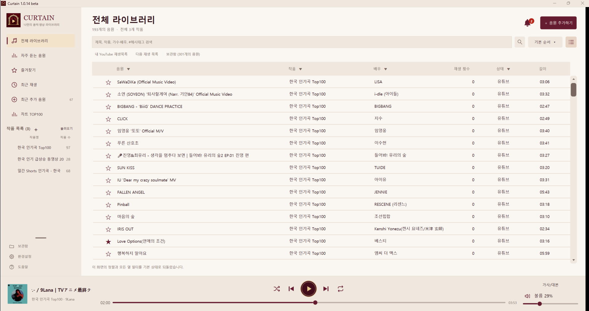

Curtain 1.0.14 beta의 실제 사용 화면 · 라이트 테마 · 사진을 클릭하면 크게 볼 수 있습니다.

## 모으고, 정리하고, 나만의 순서로 재생하세요

| 하고 싶은 일 | Curtain에서 할 수 있는 일 |
| :--- | :--- |
| **음악과 영상 모으기** | YouTube 검색·링크·재생목록과 로컬 음악·영상 파일을 한 라이브러리에 등록 |
| **작품별로 정리하기** | 작품 생성, 한 단계 속폴더, 상단 고정, 작품과 수록곡의 드래그 순서 변경 |
| **원하는 곡 찾기** | 제목·작품·가수/배우·해시태그 검색, 열별 필터, 즐겨찾기·최근 재생 |
| **새 음악 살펴보기** | 멜론 TOP100 보유 여부 비교, YouTube 인기 차트 추천, 최근 추가 음원 |
| **감상에 맞게 편집하기** | 구간 재생, 음량 보정, 가사/대본과 글자 서식, 영상 PiP |
| **내 환경으로 꾸미기** | 6가지 테마, 목록 간격·열 넓이 설정, 자동 백업과 데이터 관리 |

[음원 가져오기](#음원-가져오기) · [작품 정리](#작품-정리) · [차트와 최근 추가](#차트와-최근-추가) · [음원 편집](#음원-편집) · [화면과 데이터 관리](#화면과-데이터-관리)

## 음원 가져오기

**음원 추가하기**에서 **유튜브 (링크/검색)**, **로컬 파일 불러오기**, **문서 불러오기**를 선택하세요. YouTube는 제목으로 검색하거나 영상·재생목록 링크로 등록할 수 있습니다.

### 검색하고, 비교하고, 여러 곡을 한 번에

검색 결과에서 미리보기·가수/채널·조회수·길이를 확인하고 원하는 곡을 체크하세요. 결과 창에서 검색어를 바꿔 다시 검색할 수도 있습니다.

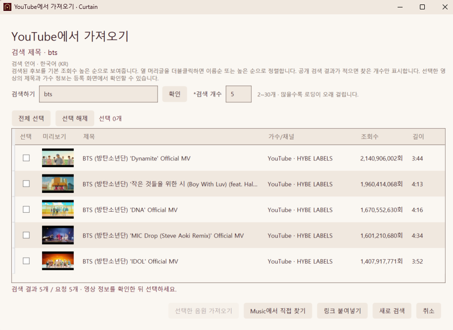

- 검색 개수는 기본 **5개**, **2~30개**로 설정합니다. 개수가 많을수록 로딩 시간이 길어집니다.
- 가져온 검색 결과는 **조회수 높은 순**으로 표시합니다. 열 머리글을 더블클릭하면 제목·가수/채널은 이름순, 조회수·길이는 높은 순으로 정렬합니다.
- 검색·가져오기 언어는 **한국어(KR)·영어(US)·일본어(JP)** 중 선택합니다. 기본값은 한국어이며, 해당 언어 정보가 없으면 원래 표기를 유지합니다.

<strong>한 곡 등록 화면 보기 — 제목과 가수명을 내 방식으로 정리</strong>

작품명 입력칸의 **▼**를 눌러 기존 작품·속폴더와 수록 곡 수를 확인하세요. 새 작품명을 직접 입력하거나, 비워 두고 작품 미지정으로 등록할 수도 있습니다.

제목과 가수/배우명은 **구분하기 / 반대로 구분하기 / 구분하지 않기**로 정리합니다. 긴 영상의 시간표가 있다면 **타임라인 등록**으로 구간별 음원을 만들 수 있습니다.

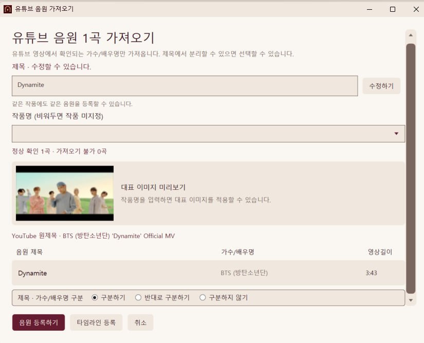

<strong>내 YouTube 재생목록 보기 — 계정 연결부터 선택 가져오기까지</strong>

**환경설정 → Google 계정**에서 계정을 연결한 뒤 **내 재생목록 보기**를 누르세요. 내 재생목록을 읽고 선택한 곡을 Curtain에 등록하며, YouTube의 원본 재생목록은 수정하지 않습니다.

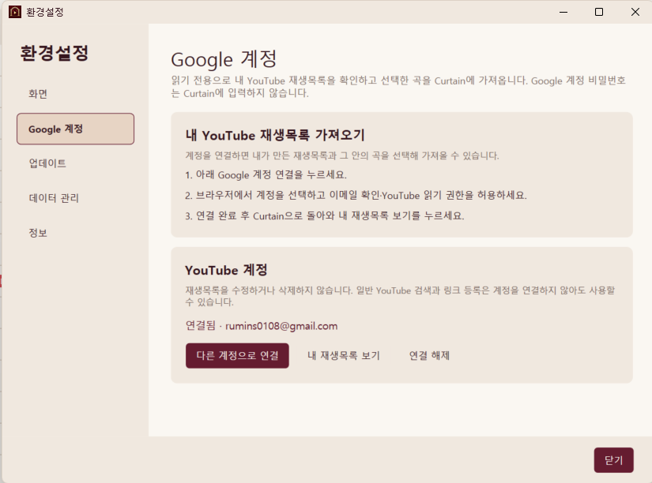

재생목록 안에서도 제목·가수 검색과 여러 곡 선택이 가능합니다. 이미 등록한 영상은 **등록된 작품명**을 함께 확인하고 숨길 수 있습니다. **제목 앞에 재생목록 순서 붙이기**를 켜면, 중복 숨기기를 반영한 표시 목록의 순서대로 번호를 붙입니다.

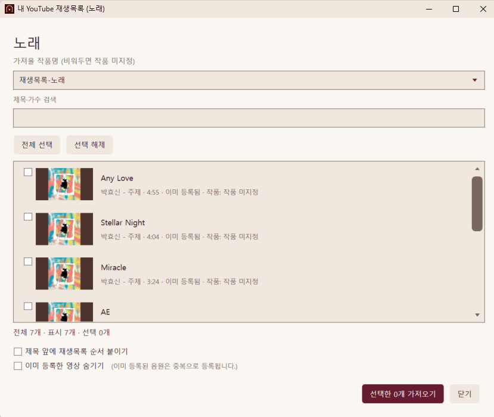

계정 연결은 현재 Google 검증 전 테스트 상태로 **등록된 테스트 계정**에서 사용할 수 있습니다. 일반 YouTube 검색·링크 등록에는 계정 연결이 필요하지 않습니다.

## 작품 정리

공연, 앨범, 장르처럼 나에게 편한 기준으로 작품을 만드세요. 작품 화면에서 대표 이미지와 설명을 바꾸고, 수록곡과 총 재생 시간을 한눈에 확인할 수 있습니다.

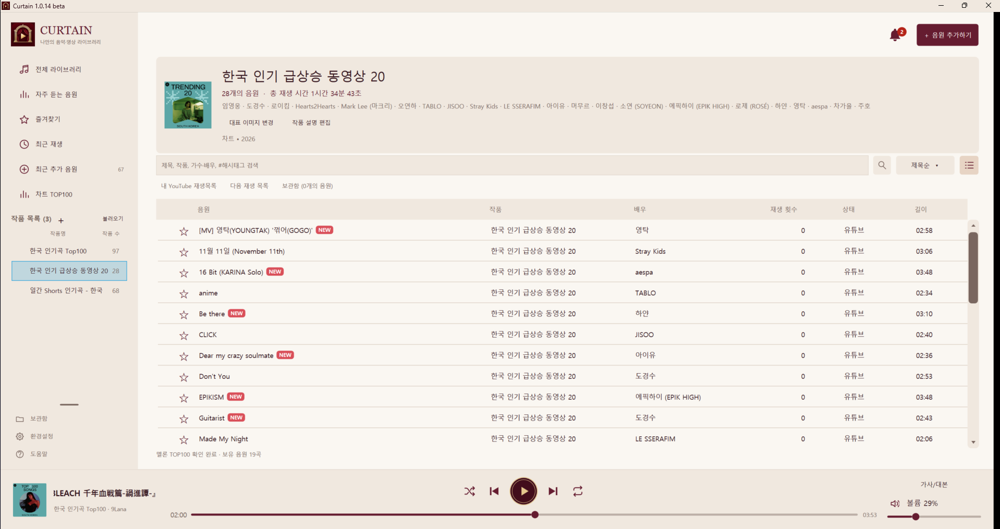

- **작품 만들기:** 작품 목록 옆 <strong>+</strong>에서 이름과 음원을 선택합니다. 선택한 곡은 기존 작품·속폴더에서 새 작품으로 이동하며, 즐겨찾기와 재생 횟수 등 음원 정보는 유지됩니다.
- **속폴더로 나누기:** 상위 작품 아래에 한 단계 속폴더를 만듭니다. 기본은 접힌 상태이며, 상위 작품을 우클릭해 펼치거나 닫습니다. 상위 작품에서는 속폴더의 곡도 함께 봅니다.
- **자주 쓰는 작품 고정:** 작품을 우클릭해 상단에 고정합니다. 개수 제한 없이 최근 고정한 작품부터 표시하며, 고정하지 않은 작품은 드래그로 옮길 수 있습니다.
- **수록곡 순서 변경:** 작품 화면의 정렬 메뉴에서 **사용자순**을 선택한 뒤 곡을 드래그하세요. 검색과 열 정렬을 해제한 상태에서 사용할 수 있으며, 작품·속폴더별 순서를 저장합니다. **제목순**으로 돌아가도 저장한 사용자순은 유지됩니다.
- **작품 선택과 공유:** 작품명 입력칸에서 기존 작품·속폴더를 고르거나, 작품을 `.curtain` 문서로 내보내 다른 Curtain 라이브러리에 불러옵니다.

## 차트와 최근 추가

### 멜론 TOP100과 내 라이브러리를 함께

**차트 TOP100**에서는 보유한 곡을 차트 순서로 감상합니다. **멜론에서 TOP100 불러오기**를 누르면 전체 차트와 보유 상태를 비교하고 필요한 곡을 선택할 수 있습니다.

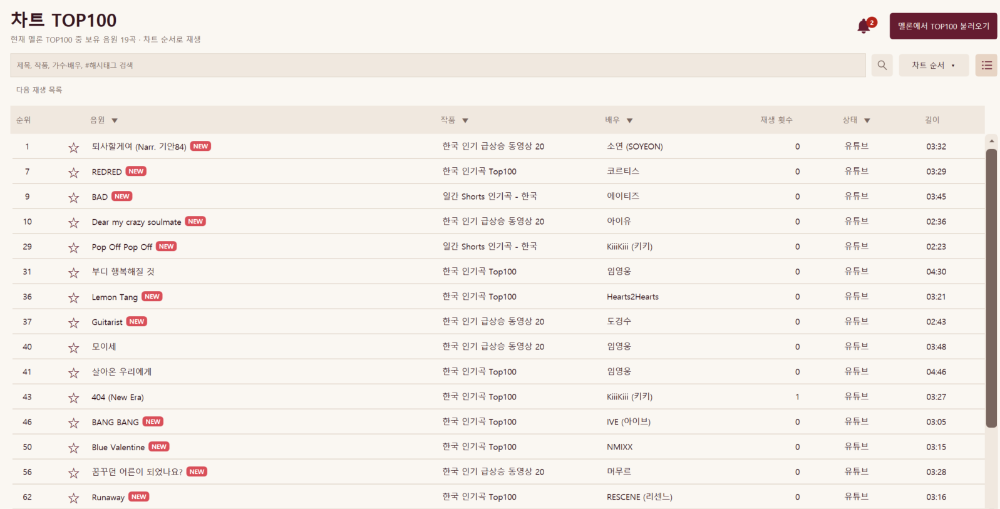

<strong>차트 가져오기 화면 보기 — 보유·보관함·확인 필요·미보유 비교</strong>

라이브러리와 보관함에 있는 곡을 구분하고, 미보유 곡이나 확인이 필요한 곡을 살펴보세요. 선택한 곡을 가져오거나 기존 음원의 YouTube 연결을 변경할 수 있습니다. 제목·가수·영상 버전이 맞는지도 함께 확인하세요.

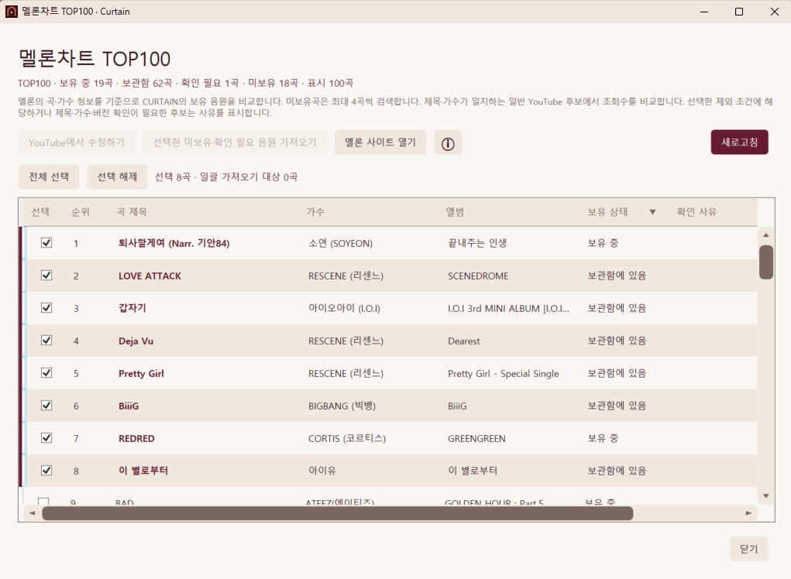

### 방금 추가한 곡을 놓치지 않도록

**최근 추가 음원**에서는 최신 등록순으로 곡을 찾습니다. 가져오기를 마친 뒤 **추가한 음원 보기**로 방금 등록한 곡을 확인할 수도 있습니다. 종 모양의 추천 알림에서는 YouTube 인기 차트의 새로운 곡을 살펴보세요.

<strong>최근 추가 음원 화면 보기 — NEW 표시가 사라지는 기준</strong>

**NEW는 등록 후 24시간이 지나거나 해당 곡을 재생하면 사라집니다. 음원은 최근 추가 목록에 계속 남습니다.**

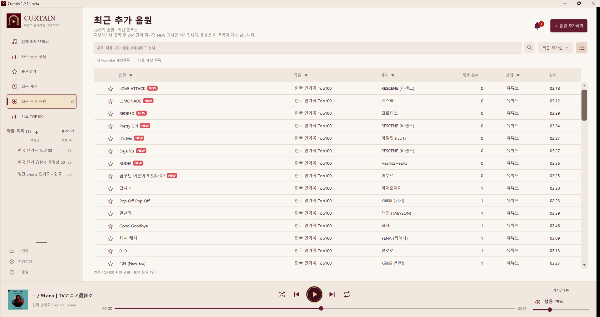

## 음원 편집

음원을 우클릭하고 **수정하기**를 선택하세요. **상세정보 수정하기**에서 제목·가수/배우·작품·링크를 바꾸고, 등록 날짜와 가져온 출처를 확인합니다. 저장 전에는 변경 내용을 확인할 수 있습니다.

### 해시태그로 나만의 분류 만들기

**해시태그 / 메모**에 `#2022작품 #2026공연`처럼 기록한 뒤, 라이브러리 검색창에서 같은 태그로 곡을 모아 보세요. 작품이 서로 달라도 공통 태그로 찾을 수 있습니다.

<strong>상세정보 수정 화면 보기 — 해시태그·구간·음량을 한곳에서</strong>

구간 시작·종료, 음량 보정, 가사/대본은 기본으로 접혀 있는 **세부설정**을 펼쳐 수정합니다. 아래 사진은 세부설정을 펼친 모습입니다. 링크를 바꾸면 확인 후 기존 음원의 연결 대상에 반영합니다.

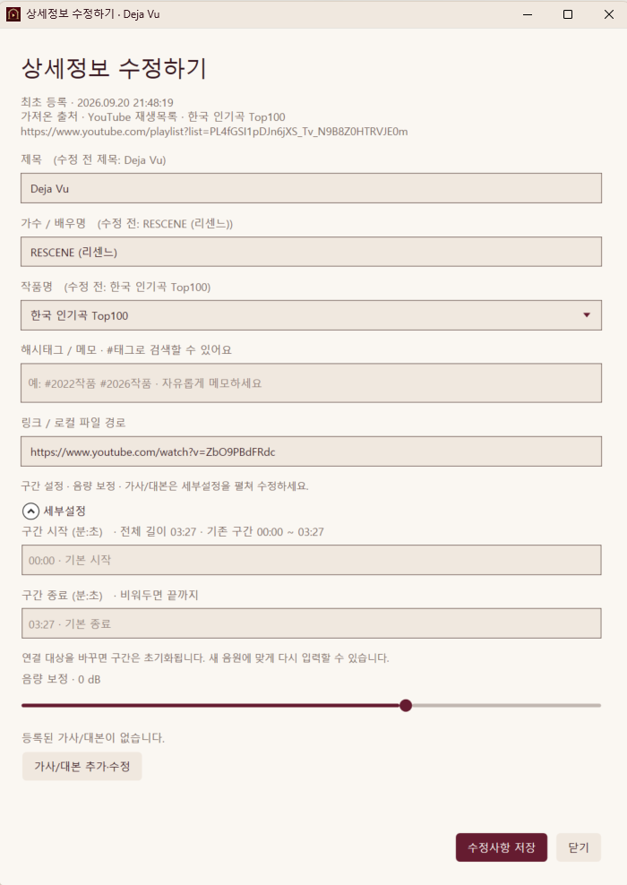

### 가사와 대본을 곁에 두고 감상하기

재생바 위 **가사/대본**을 누르면 읽기 창이 열립니다. 상단을 드래그해 옮기고, **고정핀**으로 바깥을 클릭해도 열어 둘 수 있습니다. 다시 열면 기본 위치로 돌아오며, X를 누르거나 다음 곡으로 넘어가면 닫힙니다.

내용이 없으면 안내와 함께 편집창으로 이동합니다. **굵게·밑줄·기울임·테마 글자 강조·배경 강조**로 필요한 부분을 표시하세요. 배경 강조는 글자색을 유지하면서 테마 강조색을 옅게 적용합니다.

## 화면과 데이터 관리

### 내 취향에 맞는 화면

**환경설정 → 화면**에서 라이트·버건디·다크·미드나이트 블루·체리 블라썸·포레스트 그린, **6가지 테마**를 선택합니다. 목록 간격과 열 넓이도 조절할 수 있고, 설정은 다음 실행에도 유지됩니다.

<strong>화면 설정 보기 — 테마·열 넓이·YouTube 언어</strong>

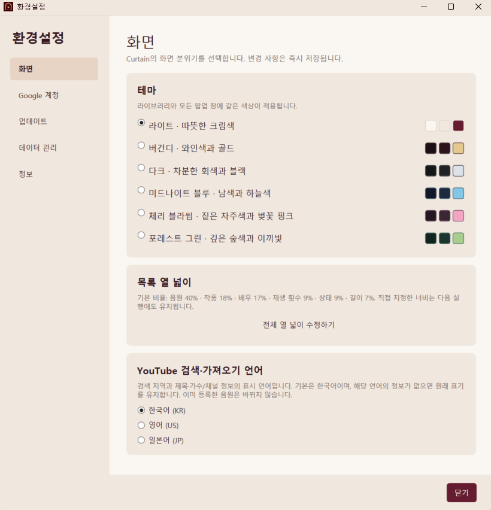

열 머리글 우클릭에서도 전체 열 넓이를 한 번에 조절할 수 있습니다.

전체 라이브러리·자주 듣는 음원·즐겨찾기·최근 재생·최근 추가 음원·차트 TOP100에서는 **음원·작품·배우·상태 필터**를 사용할 수 있습니다. 필터의 항목을 검색해 선택하고 **적용**하세요. **기본 정렬로 되돌리기**는 현재 화면의 정렬과 필터를 함께 초기화합니다.

상태는 **유튜브 / 로컬음원 / 로컬영상**으로 구분하고, 구간이 지정된 곡에는 <strong>(구간)</strong>을 표시합니다. 재생바·볼륨바는 원하는 위치를 클릭해 조절하고, 스피커 아이콘으로 음소거를 켜거나 끕니다.

### 라이브러리를 오래, 편하게 관리하기

<strong>데이터 관리 화면 보기 — 파일 연결 점검과 자동 백업</strong>

**환경설정 → 데이터 관리**에서 라이브러리 상태를 점검하고, 누락된 로컬 파일을 다시 연결합니다. 하루 한 번 자동 백업과 보관 용량을 설정하거나 직접 백업하고 복원할 수 있습니다.

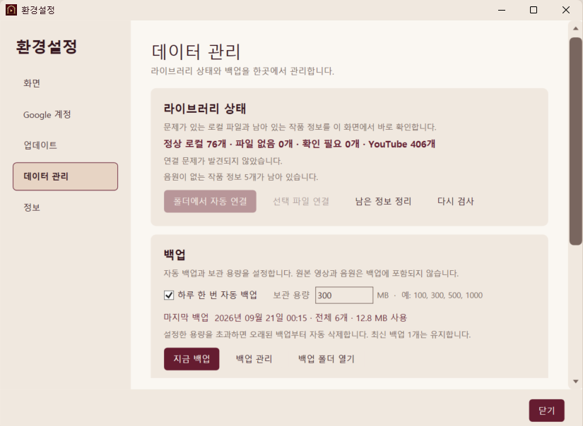

**백업에는 원본 음악·영상 파일이 포함되지 않습니다.** 로컬 원본 파일은 별도로 보관하세요.

<strong>도움말 화면 보기 — 사용 중 궁금한 기능을 바로 확인</strong>

앱 왼쪽 아래 **도움말**에서 음원 추가, 해시태그 검색, 속제목, 사용자순, 가사/대본, 백업과 공유 방법을 확인하세요.

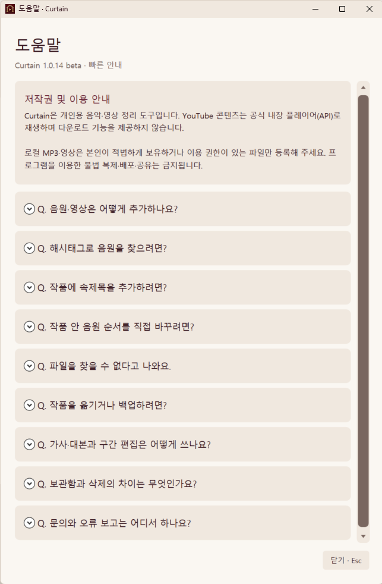

## 1.0.14 업데이트

이번 버전에는 **작품 생성·속폴더·수록곡 사용자순**, **해시태그 검색**, **이동·고정 가능한 가사/대본 창과 글자 서식**, **접어서 사용하는 세부설정**이 추가되었습니다.

[1.0.14 beta 전체 업데이트 내역 →](https://github.com/rumins0108/Curtain-Releases/releases/tag/v1.0.14-beta)

## 설치하기

**지원 환경: Windows 10 / 11, 64비트**

| 다운로드 | 사용 방법 |
| :--- | :--- |
| [Curtain-Setup-1.0.14-beta.exe](https://github.com/rumins0108/Curtain-Releases/releases/download/v1.0.14-beta/Curtain-Setup-1.0.14-beta.exe) | 내려받은 설치 파일을 실행하고 안내에 따라 설치하세요. |
| [Curtain-1.0.14-beta.zip](https://github.com/rumins0108/Curtain-Releases/releases/download/v1.0.14-beta/Curtain-1.0.14-beta.zip) | 압축을 풀고 안에 있는 **Curtain-Setup-1.0.14-beta.exe**를 실행하세요. |

두 형식 모두 같은 설치 프로그램입니다. 설치 과정에서 바탕화면 바로가기 생성 여부를 선택할 수 있습니다. 처음 실행할 때 Windows SmartScreen 경고가 보일 수 있으니 배포 페이지와 파일명이 일치하는지 확인한 뒤 진행하세요.

## 이용 안내

- **YouTube는 공식 내장 플레이어로 재생합니다.** 영상·음원을 파일로 다운로드하는 기능은 제공하지 않습니다. 이용할 수 없거나 재생이 제한된 영상은 가져오기·재생이 어려울 수 있습니다.
- **Google 연결은 내 YouTube 재생목록 열람·가져오기에 사용합니다.** 일반 검색·링크 등록과 로컬 라이브러리는 계정 연결 없이 사용할 수 있습니다. 현재 계정 연결은 등록된 테스트 계정에서 이용할 수 있습니다.
- **YouTube Music 보관함 전체 동기화는 지원하지 않습니다.** Google 연결이 YouTube Music의 로그인 검색 결과를 가져오는 기능은 아니며, ‘나중에 볼 동영상’은 YouTube 웹 바로가기입니다.
- 로컬 파일과 공유 자료는 이용 권한이 있는 콘텐츠만 사용해 주세요. Curtain을 이용한 불법 배포·공유는 금지됩니다.

---

**제작자 · 루민**

Discord: **rumins0108** (루민#2293) · [이메일 문의](mailto:rumins0108@gmail.com)

[최신 릴리스](https://github.com/rumins0108/Curtain-Releases/releases/tag/v1.0.14-beta) · [전체 업데이트 기록](https://github.com/rumins0108/Curtain-Releases/releases)

Copyright © 2026 루민. All rights reserved.

